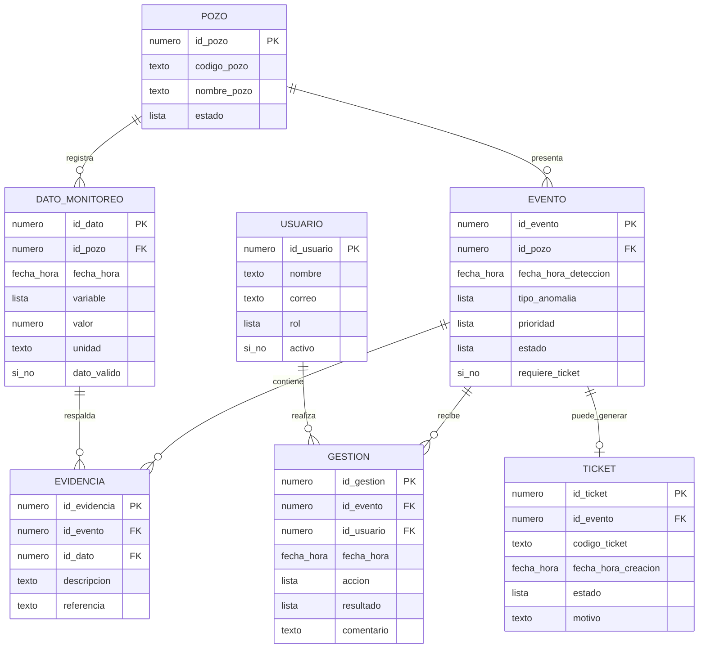

# Estructura de datos preliminar

## 1. Diagrama preliminar de la base de datos

La estructura se construyó a partir de los conceptos presentes en el caso de uso principal del proyecto: usuario/analista, pozo, datos de monitoreo, evento detectado, evidencia, gestión y ticket.

### Relaciones y cardinalidad

| Relación | Cardinalidad | Explicación |
|---|---|---|
| POZO - DATO_MONITOREO | 1:N | Un pozo puede tener muchos registros de monitoreo y cada registro pertenece a un solo pozo. |
| POZO - EVENTO | 1:N | Un pozo puede presentar varios eventos detectados en distintos momentos. |
| EVENTO - EVIDENCIA | 1:N | Un evento puede conservar una o más evidencias asociadas. |
| DATO_MONITOREO - EVIDENCIA | 1:N | Un registro puede utilizarse como respaldo de uno o más eventos, según la revisión realizada. |
| EVENTO - GESTION | 1:N | Un evento puede recibir varias acciones o revisiones durante su seguimiento. |
| USUARIO - GESTION | 1:N | Un usuario puede realizar varias gestiones y cada gestión queda asociada al responsable que la ejecutó. |
| EVENTO - TICKET | 1:1 (opcional) | Un evento puede no generar ticket; cuando corresponde, queda asociado a un ticket dentro del flujo definido actualmente. |

> Nota: el modelo es preliminar. Las cardinalidades y campos podrán ajustarse cuando se construya el PoC y se validen las necesidades reales de almacenamiento.

---

## 2. Tablas, campos obligatorios y ejemplos

El símbolo `*` identifica un campo obligatorio.

### Tabla: USUARIO

| Campo | Tipo | Clave | Obligatorio | Descripción |
|---|---|---|---|---|
| id_usuario* | número | primaria | Sí | Identificador único del usuario. |
| nombre* | texto | - | Sí | Nombre del analista o responsable. |
| correo* | texto | - | Sí | Correo del usuario. |
| rol* | lista | - | Sí | Rol dentro del proceso, por ejemplo Analista o Supervisor. |
| activo* | sí o no | - | Sí | Indica si el usuario está habilitado. |

**Ejemplos de registros**

| id_usuario* | nombre* | correo* | rol* | activo* |
|---:|---|---|---|---|
| 1 | Ana Torres | ana.torres@ejemplo.cl | Analista | Sí |
| 2 | Luis Rojas | luis.rojas@ejemplo.cl | Supervisor | Sí |

### Tabla: POZO

| Campo | Tipo | Clave | Obligatorio | Descripción |
|---|---|---|---|---|
| id_pozo* | número | primaria | Sí | Identificador interno del pozo. |
| codigo_pozo* | texto | - | Sí | Código con que se identifica el pozo. |
| nombre_pozo* | texto | - | Sí | Nombre usado para reconocer el pozo. |
| estado* | lista | - | Sí | Estado general del pozo dentro del sistema. |

**Ejemplos de registros**

| id_pozo* | codigo_pozo* | nombre_pozo* | estado* |
|---:|---|---|---|
| 101 | OB-0202-251 | PBO-01-C | Activo |
| 102 | OB-0202-252 | Pozo 252 | Activo |

### Tabla: DATO_MONITOREO

| Campo | Tipo | Clave | Obligatorio | Descripción |
|---|---|---|---|---|
| id_dato* | número | primaria | Sí | Identificador único del registro. |
| id_pozo* | número | externa | Sí | Pozo al que pertenece el dato. |
| fecha_hora* | fecha y hora | - | Sí | Momento en que se registró la medición. |
| variable* | lista | - | Sí | Variable monitoreada. |
| valor* | número | - | Sí | Valor registrado. |
| unidad* | texto | - | Sí | Unidad de medida asociada al valor. |
| dato_valido* | sí o no | - | Sí | Indica si el dato puede utilizarse en el análisis. |

**Ejemplos de registros**

| id_dato* | id_pozo* | fecha_hora* | variable* | valor* | unidad* | dato_valido* |
|---:|---:|---|---|---:|---|---|
| 5001 | 101 | 2026-09-30 10:00 | Caudal | 0,72 | L/s | Sí |
| 5002 | 102 | 2026-09-30 10:00 | Caudal | 0,00 | L/s | Sí |

### Tabla: EVENTO

| Campo | Tipo | Clave | Obligatorio | Descripción |
|---|---|---|---|---|
| id_evento* | número | primaria | Sí | Identificador del evento detectado. |
| id_pozo* | número | externa | Sí | Pozo donde se detectó el evento. |
| fecha_hora_deteccion* | fecha y hora | - | Sí | Momento en que se generó o detectó el evento. |
| tipo_anomalia* | lista | - | Sí | Tipo de anomalía detectada. |
| prioridad* | lista | - | Sí | Nivel de prioridad para su revisión. |
| estado* | lista | - | Sí | Estado de revisión del evento. |
| requiere_ticket* | sí o no | - | Sí | Indica si el evento requiere gestionar un ticket. |

**Ejemplos de registros**

| id_evento* | id_pozo* | fecha_hora_deteccion* | tipo_anomalia* | prioridad* | estado* | requiere_ticket* |
|---:|---:|---|---|---|---|---|
| 7001 | 101 | 2026-09-30 10:05 | Valor fuera de rango | Alta | En revisión | Sí |
| 7002 | 102 | 2026-09-30 10:05 | Lectura en cero | Media | Pendiente | Sí |

### Tabla: EVIDENCIA

| Campo | Tipo | Clave | Obligatorio | Descripción |
|---|---|---|---|---|
| id_evidencia* | número | primaria | Sí | Identificador único de la evidencia. |
| id_evento* | número | externa | Sí | Evento respaldado por la evidencia. |
| id_dato* | número | externa | Sí | Registro de monitoreo utilizado como respaldo. |
| descripcion* | texto | - | Sí | Explicación breve de la evidencia. |
| referencia* | texto | - | Sí | Referencia al dato, archivo o recurso utilizado. |

**Ejemplos de registros**

| id_evidencia* | id_evento* | id_dato* | descripcion* | referencia* |
|---:|---:|---:|---|---|
| 8001 | 7001 | 5001 | Registro de caudal identificado para revisión. | dato:5001 |
| 8002 | 7002 | 5002 | Registro con lectura igual a cero. | dato:5002 |

### Tabla: GESTION

| Campo | Tipo | Clave | Obligatorio | Descripción |
|---|---|---|---|---|
| id_gestion* | número | primaria | Sí | Identificador de la acción realizada. |
| id_evento* | número | externa | Sí | Evento sobre el cual se realizó la gestión. |
| id_usuario* | número | externa | Sí | Usuario responsable de la acción. |
| fecha_hora* | fecha y hora | - | Sí | Momento en que se realizó la gestión. |
| accion* | lista | - | Sí | Tipo de acción ejecutada. |
| resultado* | lista | - | Sí | Resultado de la revisión. |
| comentario* | texto | - | Sí | Observación que explica la gestión realizada. |

**Ejemplos de registros**

| id_gestion* | id_evento* | id_usuario* | fecha_hora* | accion* | resultado* | comentario* |
|---:|---:|---:|---|---|---|---|
| 8501 | 7001 | 1 | 2026-09-30 10:20 | Validar evento | Ticket requerido | Se mantiene la condición detectada y se solicita gestionar ticket. |
| 8502 | 7002 | 1 | 2026-09-30 10:25 | Revisar evidencia | Ticket requerido | Se confirma que la lectura debe ser revisada mediante ticket. |

### Tabla: TICKET

| Campo | Tipo | Clave | Obligatorio | Descripción |
|---|---|---|---|---|
| id_ticket* | número | primaria | Sí | Identificador interno del ticket. |
| id_evento* | número | externa | Sí | Evento que dio origen al ticket. |
| codigo_ticket* | texto | - | Sí | Código con que se identifica el ticket. |
| fecha_hora_creacion* | fecha y hora | - | Sí | Fecha y hora de registro del ticket. |
| estado* | lista | - | Sí | Estado actual del ticket. |
| motivo* | texto | - | Sí | Razón por la que se generó el ticket. |

**Ejemplos de registros**

| id_ticket* | id_evento* | codigo_ticket* | fecha_hora_creacion* | estado* | motivo* |
|---:|---:|---|---|---|---|
| 9001 | 7001 | TK-2026-001 | 2026-09-30 10:35 | Abierto | Revisar condición detectada en el dato de monitoreo. |
| 9002 | 7002 | TK-2026-002 | 2026-09-30 10:40 | Abierto | Revisar lectura en cero detectada por el sistema. |
